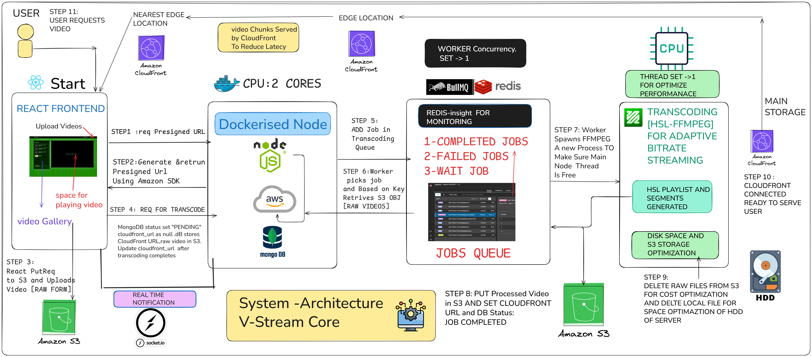
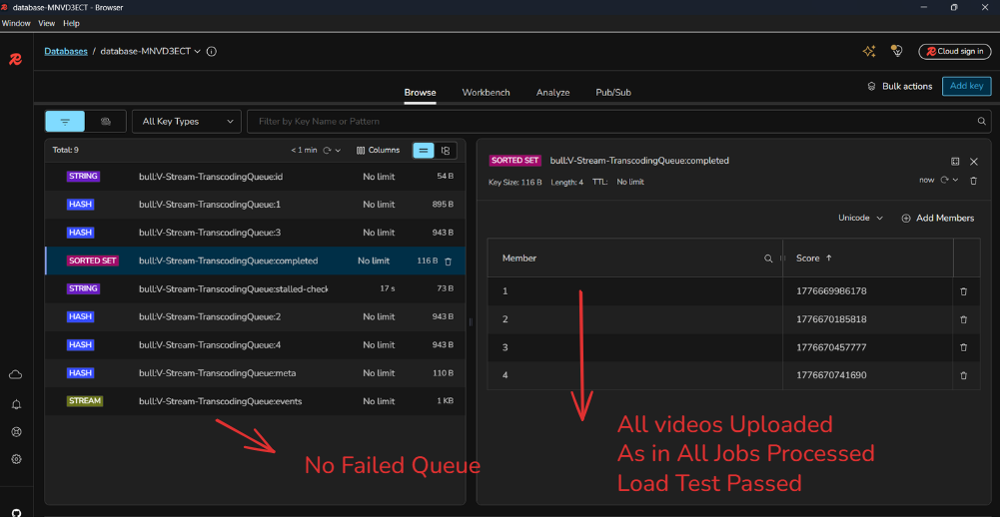
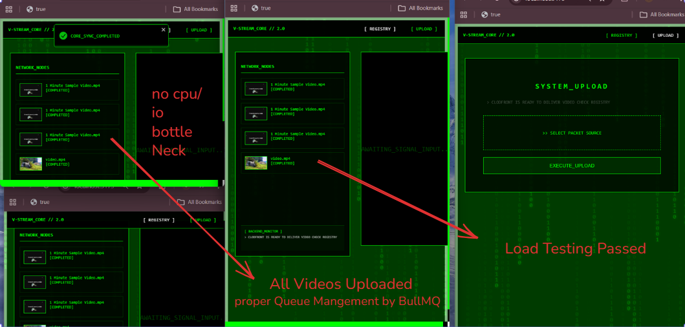
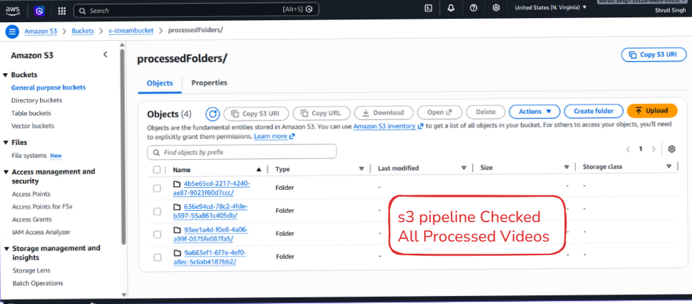
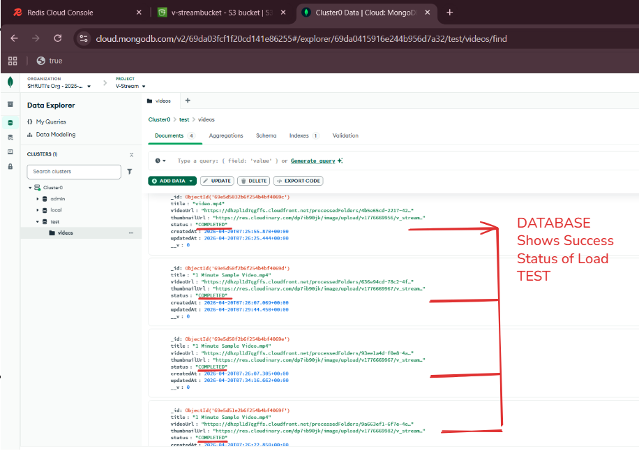
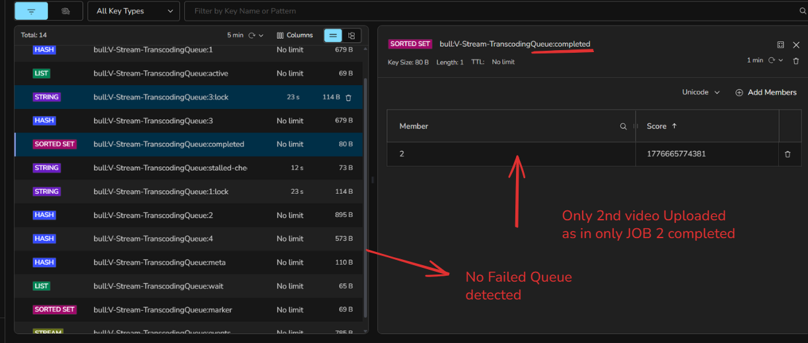
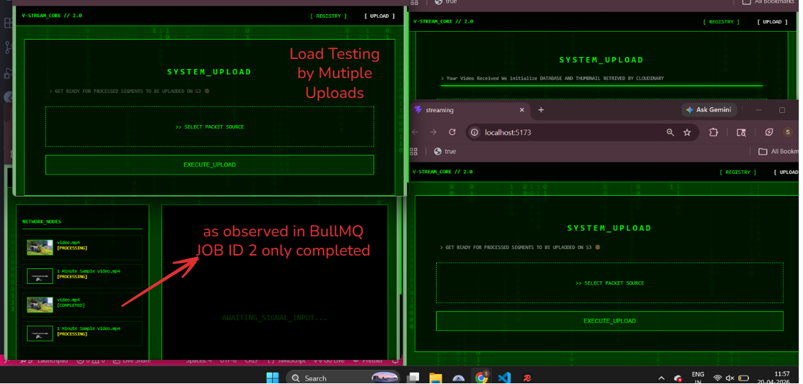

▶️REAL TIME STREAMING PLATFROM

# Video Processing: Optimization Report 📝 [Screen-Shot]

## Hardware Specifications
* **CPU:** 2 Physical Cores
* **Threads:** 4 Logical Threads
* **Runtime:** Node.js with BullMQ

---

## Performance Test Matrix

| Test ID | Setup | Node Instances/Docker Container | Concurrency | Outcome | Status |
| :--- | :--- | :--- | :--- | :--- | :--- |
| **Test 1** | 1 Thread | 2 | 2 | CPU Starvation (High Context Switching) | ❌ Failed |
| **Test 2** | 2 Threads | 1 | 1 | Functional, but slow (Context Switching overhead) | ⚠️ Suboptimal |
| **Test 3** | 1 Thread | 1 | 1 | Redis Heartbeat blocked (I/O Bottleneck) | ❌ Failed |
| **Test 4** | 1 Thread | 1 | 1 | Stable sequential processing (Optimal) | ✅ Passed |

---
## ScreenShot Of Failed And Passed Approach

## 🎯TEST 4 [Passed]:
<h1>🥇BullMQ Shows Success Result</h1>

<h1>🥇Load Testing Showing User Experience</h1>

<h1>🥇AWS S3 Bucket Pipeline</h1>

<h1>🥇MongoDB: All Videos Processed By Worker</h1>

## 🔥Analysis of Results

### Why Test 3 is the Optimal Configuration
After stress-testing with 4 parallel video uploads, **Test 3** was the only configuration that maintained system stability and maximum speed. 

* **The Context Switching Factor:** As observed in **Test 4**, increasing to 2 threads for a single-concurrency task resulted in functional processing, but the system was slower. This is due to the CPU overhead of context switching between the threads, which offsets the gains of adding an extra thread for I/O-bound tasks.
* **Elimination of Bottlenecks:** By limiting the system to 1 Node instance with 1 concurrency (Test 3), we eliminated unnecessary CPU overhead, allowing the processor to focus entirely on the heavy I/O tasks required for video processing.
* **Redis Heartbeat Stability:** Sequential processing ensures the heartbeat remains active at all times, preventing job failures.
* **Resource Allocation:** On a 2-core machine, attempting to run multiple instances or multiple threads (Test 2 & Test 4) leads to resource contention and performance degradation.
* 
 ## 📌TEST 3 [Failed]=>This is NOT Advised architecture
<h1>BullMQ Shows Result</h1>

<h1>Load Testing Showing User Experience</h1>

<h1>📒Conclusion</h1>
### Why Test 4 is the Optimal Configuration
After stress-testing with 3 parallel video uploads, **Test 4** was the only configuration that maintained system stability and maximum speed. 

* **The Context Switching Factor:** As observed in **Test 3**, increasing to 2 threads for a single-concurrency task resulted in functional processing, but the system was slower. This is due to the CPU overhead of context switching between the threads, which offsets the gains of adding an extra thread for I/O-bound tasks.
* **Elimination of Bottlenecks:** By limiting the system to 1 Node instance with 1 concurrency (Test 4), we eliminated unnecessary CPU Read and Write Clash, allowing the processor to focus entirely on the heavy I/O tasks required for video processing.
* **Redis Heartbeat Stability:** Sequential processing ensures the heartbeat remains active at all times, preventing job failures.

  
 <h1>😊Future Scope</h1>
1. Horizontal Scaling: Deploying multiple Docker containers to distribute load.
 
2. Vertical Scaling: Migrating to a high-performance server with a higher core count.
 
3. Advanced Worker Management: Scaling the Redis server and increasing worker instances for higher throughput.
 
4. Load Balancing:Implementing Nginx to distribute incoming traffic effectively.

<h1 align="center">
꧁ ༺ ⚜ ༻ ꧂
     
   </h1>
   <h1 align="center">
 Thank You 😊❣️
     
   </h1>

